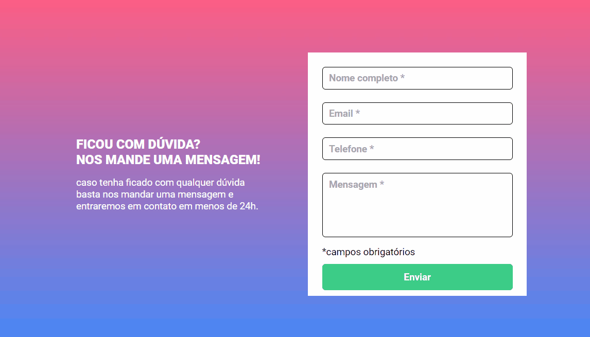

# Formulário com validação 



## ✨ Sobre o projeto

Essa foi a Quest de HTML + CSS + JS intermediário do curso DevQuest, onde o objetivo é criar um formulário de validação usando JavaScript puro. foi disponibilizado um layout no Figma junto com as orientações de como devia ser a validação.

## 🚀 Aprendizado

Consegui colocar em prática meus conhecimentos em JavaScript para resolver o desafio da melhor forma possível, fiquei bastante feliz com o resultado e vou continuar praticando para alcançar um melhor desempenho.

## 📚 Guia de Utilização:

1° Clone o repositório

```
git clone https://github.com/Fransuelton/formulario-com-validacao-javascript.git
```

2° Caso não queira clonar o repositório, acesse o Deployment [clicando aqui](https://fransuelton.github.io/formulario-com-validacao-javascript/).

## 📫 Contribuindo para o projeto:

Para contribuir com esse projeto, siga estas etapas:

1. Faça um fork deste repositório.
2. Crie um branch: `git checkout -b <nome_branch>`.
3. Faça suas alterações e confirme-as: `git commit -m '<mensagem_commit>'`
4. Envie para o repositório original: `git push origin <nome_branch>`
5. Crie a solicitação de pull.

## 🛠️ Tecnologias Utilizadas

- HTML
- CSS
- JavaScript

### Obrigado por visitar meu repositório!❤️